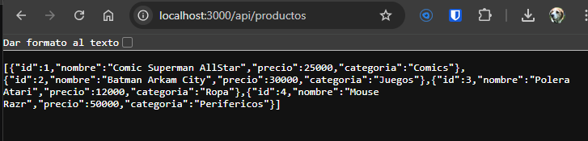
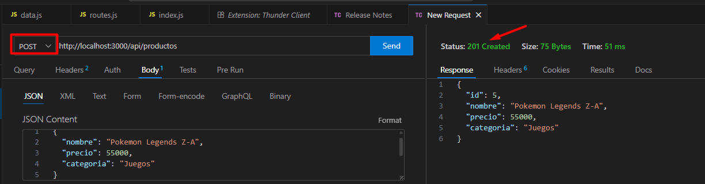
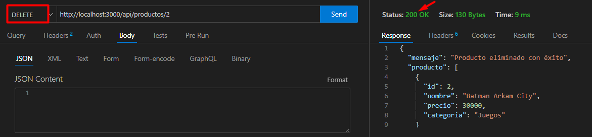

# Evaluación Semana 4: API con Express.js

**Asignatura:** Programación Back End  
**Estudiante:** NELSON ALCAINO SUAREZ 

---

## 1. Descripción del Proyecto
Este proyecto consiste en una API RESTful desarrollada con **Node.js** y **Express**. Su objetivo es gestionar un inventario de productos ñoños permitiendo realizar las cuatro operaciones fundamentales (CRUD):

* **Crear** productos nuevos.
* **Leer** el listado de productos.
* **Actualizar** información de un producto.
* **Eliminar** productos del sistema.

Los datos se almacenan en un archivo local (`data.js`) para simular una base de datos.

## 2. Instrucciones de Instalación y Ejecución

Para correr este proyecto en tu máquina local, sigue estos pasos:

1.  **Instalar dependencias:**
    Abre la terminal en la carpeta del proyecto y ejecuta:
    
    npm install
   

2.  **Iniciar el servidor:**
    Ejecuta el siguiente comando:
    
    node index.js
    

3.  **Verificar:**
    El servidor iniciará en el puerto 3000. Puedes acceder desde el navegador a: `http://localhost:3000/api/productos`

---

## 3. Pruebas de Funcionamiento (Evidencia)

A continuación se presentan las capturas de pantalla que demuestran el correcto funcionamiento de los endpoints solicitados en la rúbrica.

### A. GET (Listar registros)
Se visualiza la lista completa de productos en formato JSON desde el navegador.

### B. POST (Crear registro)
Se agrega un nuevo producto ("Pokemon Legends Z-A") enviando un JSON con `nombre`, `precio` y `categoria`. El servidor responde con código **201 Created**.

### C. PUT (Actualizar registro)
Se actualiza el precio del producto con ID 1. El servidor responde con el objeto actualizado.

### D. DELETE (Eliminar registro)
Se elimina el producto con ID 2 ("Batman Arkham City"). El servidor confirma la eliminación.

---

